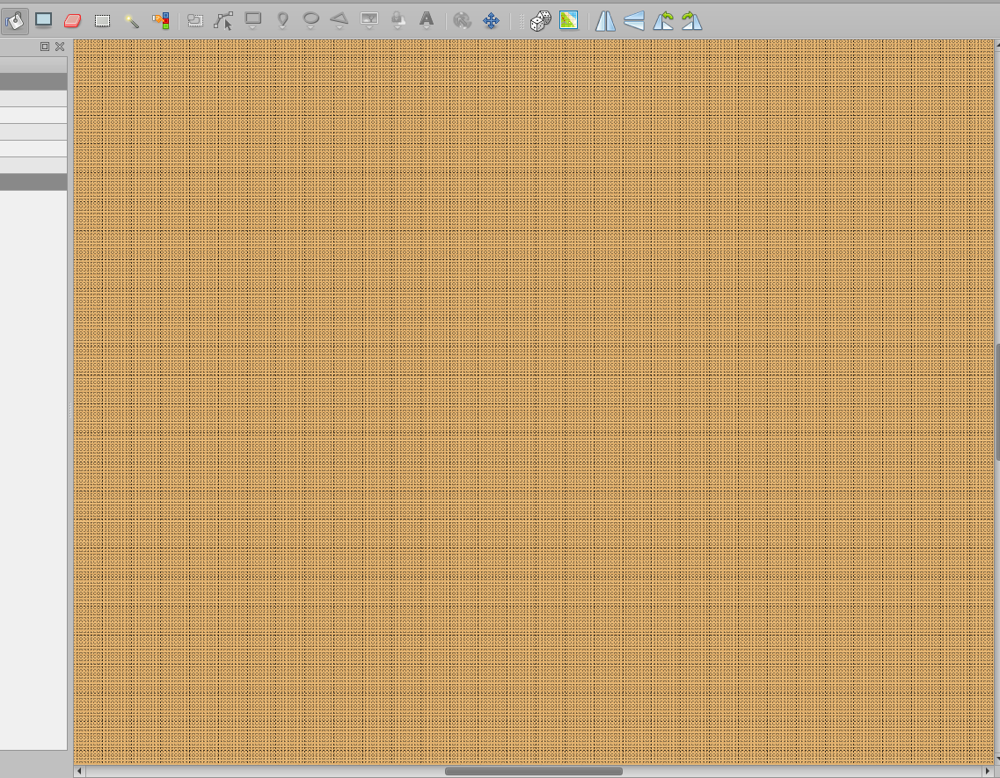
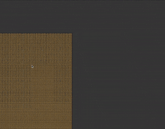
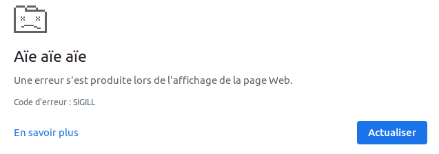

# Benchmark map for WorkAdventure

Knowing the limitations of the software you use is important. That's why I created this project.

The goal was to create an unsanely large map to see what were the limitation the softwares WorkAdventure uses to create and run maps.
This includes:
* [Tiled](https://www.mapeditor.org/)
* [Github](https://github.com/)
* [Phaser](https://phaser.io/)

## Logs
 
### Test #1: 100,000x100,000 map

So I started by saying to myself: let's create a map of 100,000x100,000 tiles.

In Tiled I therefore enter 100,000 til... wait, it's limited to 5 characters. This was fast.

### Test #2: 99,999x99,999 map

Ok so let's try 99,999x99,999.

I entered that and I validated, the grid appeared (we do not discern that it's a grid, it's more a mixture of black lines ^^).
Quite surprised by the fact that Tiled was still standing and by the fluidity of the zoom in the grid, I thought to myself "ok let's add some ground and save it all".
I saved, I waited, 15 seconds later. Bye bye birdy. Tiled was gone. We're going to have to be nicer to him...

### Test #3: 9,999x9,999 map

I restarted Tiled, I entered 9,999 in horizontal and vertical, I saved, I waited ... BOOM Tiled is KO again.

Okay from now on, let's proceed by dichotomy.

### Test #4: 5,000x5,000 map

I had high hopes for this 5,000. This time I looked at my RAM consumption and the same time I was saving.
No luck, another crash while my consumption was at 14GB (just by Tiled).

Next: 2,500... Well I have less and less hope so let's say 2,000 to have better luck.

### Test #5: 2,000x2,000 map

Same story: I save, I wait ... and let's go! The file is saved after 10 seconds of long suspense!

I could try to increase the dose but I really wanted to see the result in WorkAdventure.

With 2k it makes already... 2,000 x 2,000 = 4,000,000 tiles. Wow. And I who wanted to try 100k...
What I found impressive was how Tiled was rendering the painting of 4,000,000 tiles at once, quickly and without flinching! 
Here is a little souvenir:

Ok, some stats before my commit/push:
* Opening this file with Tiled will consume 7GB of RAM
* The JSON file size is 145MB
* It takes 10 seconds to save this big boy

Now, it's Github time!

I add the file, I commit "Biggest map ever made - muwhahaha!".
I push, and after a few seconds I see some red text. I hate it when there is red text in my terminal.
I look at why the baby is crying and he tells me the file is too big, github doesn't want it, we have to go with a solution called "Git LFS" (for Large File Storage).
These Githubians have planned everything.

So I look at the documentation, try to install and use it (it's hell). 12 years later, I finally manage to push my repository. OK now no more surprises... OK?
It turned out that using LFS is not possible for us because of the extrude github action that wants a real JSON file, not just a reference to a file (that's how LFS works).

Conclusion, the file must be less than 100MB. So the plan is to cut the map in Tiled until we get our big winner.

### Test #6: 1,600x1,600 map

After 3-4 attempts, I arrive at a result of 1600x1600 tiles for a file that goes under the 100MB mark (~ 90MB).
Before pushing one last time I take the design of the [starter kit](https://github.com/thecodingmachine/workadventure-map-starter-kit) repo (it's a small office) which I duplicate over the entire width and height of the map. This small setup contained 2 jitsi areas and enough furniture for my test.

Just to give you an idea here, this map contains about 47 of these small offices across the width and 88 across the height, making no less than 4,136 offices ready to kick in the doors of WorkAdventure!

Little update to the stats:
* Opening this file with Tiled will now consume less than 2GB of RAM
* The JSON file size is 93MB
* It takes 6 seconds to save this big boy

Now what I want to do is to add this damn stat:
* It takes X minutes for the player to travel the entire map horizontally

So here we go: I push, the Github actions are now working, I wait a bit for Github Pages to be OK, I open the deployment, I click on my [WorkAdventure link](https://play.workadventu.re/_/this-is/valdotr.github.io/largest-map-ever/map.json)! ... aaaand the winner is... SIGILL. Yep, that's his real name:
 

So now it's probably Phaser's turn to get in my way... the world is crap.

### Test #7: ?x? map

TO BE CONTINUED...

## Config

Tested with this PC config:
- OS: Ubuntu 20.04.1 LTS
- RAM: 32GB
- CPU: Intel Core i7 - 7700HQ @ 2.80GHz x 8
- GPU: Mesa Intel HD Graphics 630 (KBL GT2)

## Installation and licenses

See https://github.com/thecodingmachine/workadventure-map-starter-kit/blob/master/README.md