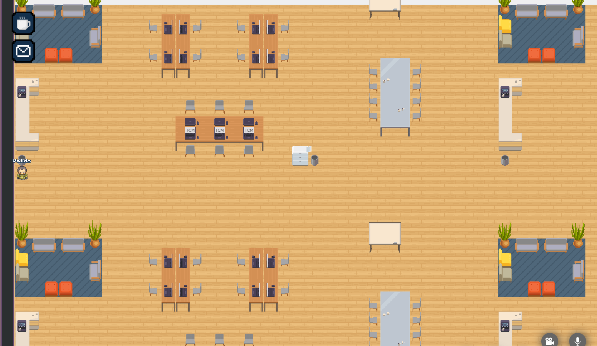

# Benchmark map for WorkAdventure

Knowing the limitations of the software you use is important. That's why I created this project.

The goal was to create an insanely large map to see what were the software limitations that WorkAdventure uses to create and run maps.
This includes:
* [Tiled](https://www.mapeditor.org/)
* [GitHub](https://github.com/)
* [Phaser](https://phaser.io/)

## Logs
 
### Test #1: 100,000x100,000 tiles

So I started by saying to myself: let's create a map of 100,000x100,000 tiles.

In Tiled I therefore entered 100,000 ti... wait, it's limited to 5 characters. This was fast.

### Test #2: 99,999x99,999 tiles

Ok, so let's try 99,999x99,999.

I entered that, and I validated, the grid appeared (we do not discern that it's a grid, it's more a mixture of black lines ^^).
Quite surprised by the fact that Tiled was still standing. The fluidity of the zoom level is impressive. I thought to myself "ok let's add some ground and save it all".
I saved. I waited about 15 seconds. 🎶 Bye bye birdy 🎶, Tiled was gone. We're going to have to be nicer to him...

### Test #3: 9,999x9,999 tiles

I restarted Tiled, I entered 9,999 in horizontal and vertical, I saved, I waited ... BOOM, Tiled was KO again.

Okay, from now on, let's proceed by dichotomy.

### Test #4: 5,000x5,000 tiles

I had high hopes for this 5,000. This time I looked at my RAM consumption when I was saving.
No luck, another crash while my consumption was at 14 GB (just by Tiled).

Next: 2,500... Well, I have less and less hope, so let's say 2,000 to have better luck.

### Test #5: 2,000x2,000 tiles

Same story: I saved, I waited ... and let's go! The file is saved after 10 seconds of long suspense!

I could try to increase the dose, but I really wanted to see the result in WorkAdventure.

With 2k it makes already... 2,000 x 2,000 tiles = 4,000,000 tiles = 128,000,000 pixels. Wow. Remember when I wanted to try 100k?...
What I found impressive was how Tiled was rendering the painting of 4,000,000 tiles at once, quickly and without flinching! 
Here is a little souvenir:

Ok, some stats before my commit/push:
* Opening this file with Tiled will consume 7 GB of RAM
* The JSON file size is 145 MB
* It takes 10 seconds to save this big boy

Now, it's GitHub time!

I add the file, I committed "Biggest map ever made - muwhahaha!".
I pushed, and after a few seconds I saw some red text. I hate it when there is red text in my terminal.
It was telling me the file was too big. GitHub doesn't want it, we have to go with a solution called "Git LFS" (for Large File Storage).
These Githubians have planned everything.

So I looked at the documentation, tried to install and use it (it's hell). 12 years later, I finally managed to push my repository. OK now no more surprises... OK?
It turned out that using LFS is not possible for us because of one of the GitHub actions (thextruding program) that wants a real JSON file, not just a reference to a file (that's how LFS works).

In conclusion, the file must be less than 100 MB. So the plan is to cut the map in Tiled until we get it.

### Test #6: 1,600x1,600 tiles

After 3-4 attempts, I arrived at a result of 1600x1600 tiles for a file that goes under the 100 MB mark (~ 90 MB).
Before pushing one last time, I took the design of the [starter kit](https://github.com/thecodingmachine/workadventure-map-starter-kit) repo (it's a small office) which I duplicated over the entire width and height of the map. This small setup contains 2 Jitsi areas and enough furniture for my test.

Just to give you an idea here, this map contains about 47 of these small offices across the width and 88 across the height, making no less than 4,136 offices ready to kick in the doors of WorkAdventure!

Little update to the stats:
* Opening this file with Tiled will now consume less than 2 GB of RAM
* The JSON file size is 93 MB
* It takes 6 seconds to save this big boy

Now what I want to do is to add this damn stat:
* It takes X minutes for the player to travel the entire map horizontally

So here we go: I pushed, the GitHub actions are now working, I waited a bit for GitHub Pages to be OK, I opened the deployment, I clicedk on my [WorkAdventure link](https://play.workadventu.re/_/this-is/valdotr.github.io/largest-map-ever/map.json)! ... aaaand the winner is... SIGILL. Yep, that's his real name:
 

So now it's probably Phaser's turn to get in my way... the world is crap, really.

### Test #7: 1200x1200 tiles

Seven is my favorite number. It has to work.

I had the feeling that the next step will work, so I used a different strategy: I started with a solution that I knew it will work, increasing the number until having the final word. So I started with 600x600, then 800x800, then 1200x1200 and finally 1400 crashed the same way as 1600.
Let's analyze our map with 1200x1200 tiles:

* Opening this file with Tiled consumes a negligible amount of RAM
* The JSON file size is 52 MB
* It takes 6 seconds to open the file and 3 seconds to save it
* It takes 3'33" for the player to travel the entire map horizontally
* It takes 15 seconds to load the map in WorkAdventure

We are not finished yet. Now that the number of tiles is not an issue anymore, let's increase the number of layers!
The current map has 12 layers.

### Test #7.1: 1200x1200 tiles / 100 layers

## Config

Tested with this PC config:
- OS: Ubuntu 20.04.1 LTS
- RAM: 32 GB
- CPU: Intel Core i7 - 7700HQ @ 2.80GHz x 8
- GPU: Mesa Intel HD Graphics 630 (KBL GT2)

## Installation and licenses

See https://github.com/thecodingmachine/workadventure-map-starter-kit